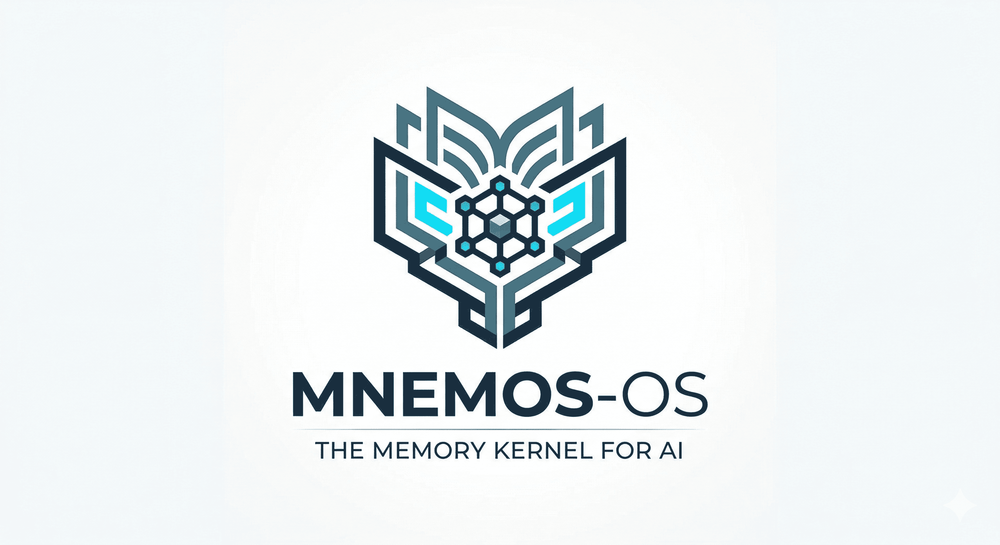
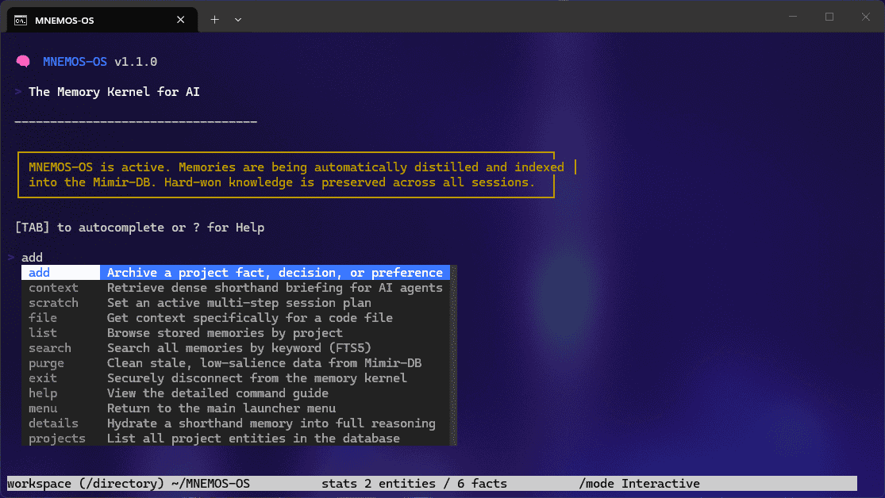

MNEMOS-OS is a local-first, high-performance memory kernel for AI-augmented development. It eliminates "AI Amnesia" and conversational noise by **distilling** complex developer sessions into high-density **AAAK-Lite shorthand** — providing surgical context, mistake-prevention guardrails, and unbreakable task continuity without bloating the context window or sacrificing privacy.


> <br>
>
> ### 🚀 New in v1.1.0 (The Cognition Update)
> - 🧠 **Relational Memory:** Link decisions to form logic chains (`related_id`).
> - 🔥 **Active Salience:** High-utility memories stay "hot" in the context window.
> - 💧 **Memory Hydration:** Agents can "hydrate" shorthand into full reasoning.
> - 🗺️ **Discovery Protocol:** Query knowledge from across your entire workspace.
>
> <br>

<br>


## 📦 Quick Installation

```bash
git clone https://github.com/thewalkinggeek/MNEMOS-OS.git
cd MNEMOS-OS
```
[](https://github.com/thewalkinggeek/MNEMOS-OS/archive/refs/heads/main.zip)

<br>

## ✨ Key Features

### 💎 AAAK-Lite Compression
MNEMOS compresses your logs into a high-density dialect natively readable by LLMs but taking up **90% fewer tokens**. 1,000 words become 50 tokens of "Fact-Shorthand."

### 🧠 Cognitive Intelligence
MNEMOS evolves with you. It uses **Active Salience** to keep high-utility memories "hot," **Memory Hydration** to expand shorthand on-demand, and **Relational Linking** to trace reasoning across complex logic chains.

### 🏛️ MÍMIR-DB 
Powered by **SQLite 3 with FTS5**, MNEMOS provides near-instant context retrieval using relational logic and decay-based priority.

### 🧹 The Lethe Protocol 
Allows power users to tune their database "noise." The built-in Janitor can be configured to remove stale memories based on custom age and salience thresholds.

### 🛡️ The "Anti-Pattern" Vault
Track mistakes and dead-ends. Use the `ANTI` aspect to create guardrails that prevent your AI from repeating known errors or following inefficient paths.

### 📝 Active Scratchpad & File-Linking
Ensures session continuity by storing active multi-step plans. You can also link memories directly to file paths for surgical, file-specific context retrieval.

### ⚡ High-Velocity Interactive CLI
A text-based terminal with **Ghost Suggestions**, **Tab Completion**, and **Command History**.

<br>

## 📈 Performance Benchmarks
MNEMOS-OS is engineered for industrial-scale development. In standard stress tests (1,000+ facts):
*   **Ingestion Speed:** ~3.0ms per fact (real-time indexing).
*   **Retrieval Latency:** < 5.0ms for full context assembly.
*   **Search Latency:** < 4.0ms for global keyword search (FTS5).
*   **Token Density:** Up to **30x compression** for complex architectural logs.
*   **Storage Efficiency:** ~8,500 tokens saved per 1,000 memories.

<br>

## 🚀 Getting Started

### **For AI Agents (MCP Server)**
Point your AI tool to the main launcher with the `mcp` argument:
*   `[PATH]/MNEMOS-OS/mnemos.bat mcp` (Windows)
*   `[PATH]/MNEMOS-OS/mnemos.sh mcp` (Unix)

**🤖 AI Briefing:** Simply say: *"Read `MNEMOS-OS/INSTRUCTIONS_FOR_AI.md` and brief yourself on my project."*

### **For Humans (Interactive CLI)**
1. Navigate to the `MNEMOS-OS` folder.
2. Run **`mnemos.bat`** (Windows) or `./mnemos.sh` (Linux/macOS).

---

## 🔌 Advanced Integration Guides

<details>
<summary><b>♊ Gemini CLI</b></summary>

Run this command to register globally:
```bash
gemini mcp add mnemos-os python "[PATH_TO_MNEMOS-OS]/cli/mcp_server.py" --scope user --trust
```
Or manually edit `%USERPROFILE%\.gemini\settings.json`:
```json
{
  "mcpServers": {
    "mnemos-os": {
      "command": "python",
      "args": ["[PATH_TO_MNEMOS-OS]/cli/mcp_server.py"],
      "env": { "PYTHONPATH": "[PATH_TO_MNEMOS-OS]" }
    }
  }
}
```
</details>

<details>
<summary><b>🤖 Claude Desktop</b></summary>

Add to `%APPDATA%\Claude\claude_desktop_config.json`:
```json
{
  "mcpServers": {
    "mnemos-os": {
      "command": "python",
      "args": ["[PATH_TO_MNEMOS-OS]/cli/mcp_server.py"],
      "env": { "PYTHONPATH": "[PATH_TO_MNEMOS-OS]" }
    }
  }
}
```
</details>

<details>
<summary><b>🐚 Claude Code (CLI)</b></summary>

```bash
claude mcp add mnemos-os "[PATH_TO_MNEMOS-OS]/mnemos.bat" mcp --scope user
```
</details>

<details>
<summary><b>🖱️ Cursor IDE</b></summary>

1. Open **Cursor Settings** (`Ctrl + Shift + J`) > **Features** > **MCP**.
2. **Add new MCP server**:
   - **Name:** `MNEMOS-OS`
   - **Type:** `command`
   - **Command:** `[PATH_TO_MNEMOS-OS]/mnemos.bat mcp`
</details>

<details>
<summary><b>🏄 Windsurf IDE</b></summary>

1. Open **Settings** > **Advanced** > **Cascade** > **MCP Servers**.
2. **Add custom server +** and paste:
```json
{
  "mcpServers": {
    "mnemos-os": {
      "command": "[PATH_TO_MNEMOS-OS]/mnemos.bat",
      "args": ["mcp"]
    }
  }
}
```
</details>

---

## 🛠️ CLI Command Reference




*   `add <entity> <aspect> "<text>"`: Save a memory. Use your project name as the `<entity>` (e.g., `Ocelli`). Use `GLOBAL` for universal preferences. Supports optional `--salience 1-10`, `--file path`, and `--related id`.
*   `details <id>`: **Hydrate** a shorthand memory into full reasoning and see relational links.
*   `projects`: List all project entities (knowledge bases) in the system.
*   `scratch "<plan>"`: Update the active session scratchpad for the current project.
*   `file "<path>"`: Retrieve memories linked to a specific file (including parent directory context).
*   `context <entity>`: Retrieve the active mindset (blends project facts + global preferences).
*   `search "<query>"`: Fast keyword search across all memories and raw content (FTS5).
*   `list [entity]`: List all memories or all known project entities.
*   `menu`: Return to the main selection screen.
*   `purge [--days N] [--min-salience N]`: Tunable cleanup of stale memories.

<br>

## 💡 Usage Tips

### **⌨️ Terminal Masterclass**
*   **Ghost Text:** Press the **Right Arrow** to accept gray suggestions.
*   **Tab Completion:** Press **Tab** to cycle commands or memory categories.
*   **Deep Help:** Type `help` in the terminal for a detailed command guide.

### **🛡️ Advanced Workflows**
*   **Guardrails:** Use the `ANTI` aspect to teach your AI what *not* to do (e.g., `add Project ANTI "Avoid nested loops in render"`).
*   **Continuity:** Use the `scratch` command before starting complex tasks so your AI never loses the plan.
*   **Surgical Context:** Use `--file [path]` when adding facts to link them directly to a specific code file.

<br>

## 🗣️ The AAAK-Lite Syntax

| Prefix | Category | Meaning | Example |
| :--- | :--- | :--- | :--- |
| `*` | **PREF** | User Preferences | `*vCSS_modular` |
| `!` | **BUG** | Critical Issues | `!GCal_403_err` |
| `?` | **ARCH** | Structural Decisions | `?sqlite_fts5_triggers` |
| `@` | **DEP** | External Dependencies | `@python_sqlite3` |
| `~` | **ANTI** | Mistakes/Guardrails | `~no_setInterval` |
| `>` | **LOG** | General Progress | `>core_logic_done` |

---

## 📂 Project Architecture
```text
/MNEMOS-OS/
├── .cursorrules        # IDE Protocol (Cursor)
├── .windsurfrules      # IDE Protocol (Windsurf)
├── .clinerules         # IDE Protocol (Cline/Roo)
├── GEMINI.md           # CLI Protocol (Gemini)
├── INSTRUCTIONS_FOR_AI # Core Memory Mandates
├── cli/                # Terminal & MCP Server
├── core/               # Compression & Logic
└── data/               # MÍMIR-DB (SQLite)
```

<br>

<br>

## 📄 License & Copyright

Copyright © 2026 **Jonathan Schoenberger**
Licensed under the **GNU General Public License v3.0 (GPLv3)**

*"Memory is not just storage; it is architecture."*

  <p><i>"Memory is not just storage; it is architecture."</i></p>
</div>
